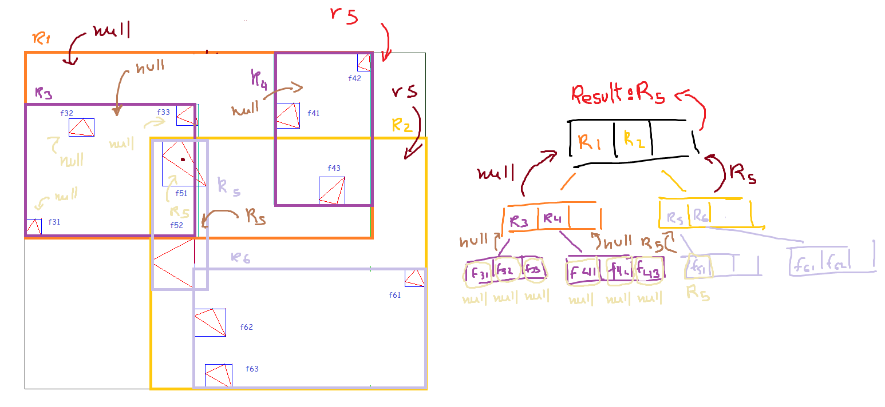

# R-Tree

## Cómo correrlo

### Prerequisitos

> Recordar de que antes de instalar cualquier librería siempre es recomendable correr `sudo apt update` y `sudo apt upgrade` primero.

Para ejecutar el R-Tree es necesario contar con la librería **SDL2**, puesto que esta es la que se empleó para crear la interfaz gráfica.

Si se está empleando Linux, basta con utilizar los comandos mostrado a continuación para descargarla.
```
sudo apt-get install libdsl2-2.0
sudo apt-get install libdsl2-dev
```

Cabe mencionar también que se requiere de **g++** para la compilación. Si es que no se tiene este instalado, usar
```
sudo apt install g++
```
para hacerlo.

Una vez cubiertos estos prerequisitos, podemos ejecutarlo.

### Compilación

Para poder hacer la compilación, ofrecemos dos formas:

1. Usando el Makefile adjunto:
```
make build
```

2. Usando la línea de comando directamente:
```
g++ main.cpp Display.cpp structs/rtree.cpp -lSDL2
```

### Ejecución

Correr el ejecutable que resulta de la compilación.

Los comandos son sencillos:
- **Click izquierdo:** añadir un punto (sea independiente o para formar una figura)
- **Click derecho:** remover una figura

El R-Tree se actualiza automáticamente tras recibir este input.

## Estructuras

### Point 
Comencemos con la estructura **Point**, la cual define a un punto en la pantalla. Esta cuenta con dos atributos que indican sus coordenadas. Sus métodos se explican en la misma estructura:
```cpp
struct Point{
    int x, y;

    // min y max van a crear un nuevo punto con las componentes minimas 
    // y maximas de cada par de puntos respectivamente
    static inline Point max(const Point &m1, const Point &m2);
    static inline Point min(const Point &m1, const Point &m2);

    // constructor
    Point(int pos_x, int pos_y);

    // operadores 
    friend bool operator==(const Point& left, const Point& other);
    friend bool operator!=(const Point& left, const Point& other);

    // distancia cartesiana entre 2 puntos (este y el otro)
    double length(const Point& other);
    // función booleana que te dice si el punto "other" esta lo suficientemente
    // cerca de el punto que llama este metodo
    bool closeEnough(const Point& other);
    // dibuja el punto en la pantalla
    void draw(SDL_Renderer* renderer) const;
};
```

### Minimum Bounding Box
Seguimos con la estructura MBB, que define el minimum bounding box de alguna figura o punto.
```cpp
struct MBB{

    //top left, bottom right
    Point topLeft, bottomRight;

    MBB();
    // devuelve el perimetro del MBB
    int Perimeter() const;
    // dibuja el MBB con el color por defecto (azul oscuro)
    void draw(SDL_Renderer* renderer) const;
    // dibuja el MBB con un color especifico
    void draw(SDL_Renderer* renderer, Color color) const;
    // crea un nuevo MBB que encapsula m1 y m2
    static MBB merge(const MBB& m1, const MBB& m2);
    // regresa los valores  del MBB a sus valores por defecto
    void clear();

};
```
### Figure
Finalmente tenemos la estructura Figure, la cual es un conjunto de puntos rodeado por un MBB.
```cpp
struct Figure{

    private:

        std::vector<Point> points;
        MBB bound;

        friend class Rtree;

        static inline Point max(const Point &m1, const Point &m2);

        static inline Point min(const Point &m1, const Point &m2);
        // actualiza el MBB con el nuevo punto agregado
        void updateBound(const Point& newPoint);

    public:

        Figure();

        MBB getBound() const;
        // agrega un punto a la figura y retorna falso en caso la figura sea cerrada
        bool addPoint(const Point& p);
        // retorna la figura a sus valores por defecto
        void clear();
        // dibuja la figura
        void draw(SDL_Renderer* renderer) const;

};
```
> Cabe mencionar de que consideramos un **punto** que va a insertarse en el R-Tree como una figura de un sólo punto, es decir una figura de 1x1, en vez de una instancia de la estructura punto, motivo por el cual las funciones a continuación funcionan para tanto "puntos" como "figuras".

## Funciones

### Inserción

El Rtree cuenta con el método `insert` el cual recibe una figura como argumento y este va a llamar a la función insert que recibe un nodo y una figura.
```cpp
bool Rtree::insert(Figure *f){

    root = ::insert(root, f);
    return true;
}
```
La función `insert` es una función que busca el sub-árbol al que le corresponde ir la figura a insertar de manera recursiva apoyándose de la función `chooseSubtree`. Una vez que lo encuentre lo hará, y, en caso exista un desbordamiento, llamará a la función `handleOverflow`. Finalmente, la función retorna la raíz del árbol.
```cpp
RNode* insert(RNode* node, Figure* figure){
    if(node->isLeaf()){
        node->myFigures.push_back(new Figure(*figure));
        //actualizas el mbb, agregando esta figura
        node->bound = MBB::merge(node->bound, figure->getBound());
        if(node->myFigures.size() == ORDER + 1)
            handleOverflow(node);
    }
    else{
        RNode* v = chooseSubtree(node, figure);
        insert(v, figure);
        // insertaste la figura entonces toca actualizar el mbb
        node->bound = RNode::regionsMbb(node->regions);
    }
    // si se ha generado una nueva raíz por desbordamiento retorna a la nueva raíz
    if(node->father)
        return node->father;
    return node;    
}
```

La función `handleOverflow` va a repartir el nodo desbordado en 2 nodos y, en caso sea necesario, va a crear un nodo padre para el par de nodos.
```cpp
void handleOverflow(RNode* nodeOverflowed){
    RNode* v = new RNode;
    split(nodeOverflowed, v);// reparte los elementos del nodo en si mismo y v de la forma más conveniente
    if(!nodeOverflowed->father){// si no hay nodo padre lo creas
        RNode* root = new RNode;
        addChildrenToFather(root, nodeOverflowed, v);
    }
    else{// si hay padre solo agregas v como hijo al padre
        RNode* w = nodeOverflowed->father;
        // update MBR(u) in w or whatever that means
        v->father = w;
        w->regions.push_back(v);
        w->bound = RNode::regionsMbb(w->regions);
        if(w->regions.size() == ORDER + 1)// revisas si el padre esta desbordado
            handleOverflow(w);
    }
}
```


### Búsqueda

El Rtree cuenta con el método `search`, el cual recibe un punto como argumento.

```cpp
RNode* Rtree::search(Point p) {
    return search(root, p);
}
```

Este va a llamar a la función `search`, la cual recibe un punto y un nodo para retornar la primera figura que contenga al punto. Si no se encuentra ninguna figura candidata, se retornara nullptr.

```cpp
RNode*  Rtree::search(RNode*  n, Point  p) {

	if (n->isLeaf()) {
		for(auto  f : n->myFigures) {
			if (inArea(f->bound, p))
				return  n;
		}
		return  nullptr;
	}
	for (auto  r : n->regions) {
		if (inArea(r->bound, p)){
			auto  res  =  search(r, p);
			if(res  !=  nullptr) return  res;
		}
	}
	return  nullptr;
}
```
Cabe mencionar de que **nuestra definición de que un punto este contenido en una región, o figura, es que esta se encuentre dentro del MBB definido por el nodo figura o nodo región.** Para corroborar esto se usa la funcion `inArea()`.
```cpp
bool inArea(MBB b, Point p) {
    if(b.topLeft == b.bottomRight){
        if(p.closeEnough(b.topLeft)){
            return true;
        }
        return false;
    }
    if(
        (p.x > b.topLeft.x && p.x < b.bottomRight.x) &&
        (p.y > b.topLeft.y && p.y < b.bottomRight.y)
    )
        return true;
    return false;
}
```

Se muestra una ilustración del proceso a continuación:


### Borrado
